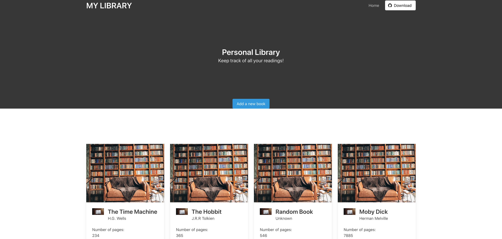

# Introduction To Javascript - BUILDING A PERSONAL LIBRARY

<!-- TABLE OF CONTENTS -->
## Table of Contents

* [About the Project](#about-the-project)
  * [Installation](#installation)
  * [Built With](#built-with)
* [Authors](#suthors)
* [Acknowledgements](#acknowledgements)

<!-- ABOUT THE PROJECT -->
## About The Project

A simple vanila Javascript, HTML, and CSS3, project which allows users to add books to their personal library and track read books. 
The book database will be stored in the users localstorage.

## Live Demo
[Library](https://rawcdn.githack.com/mariobarrioss/library/6fc9c391ecace0a5a44610a2a937800d75af4f8a/index.html)
<!-- INSTALLATION -->
## Installation

Download or clone the [repo here](https://github.com/mariobarrioss/library) and open the html file in the browser of your choice.

### Built With
This project was built using these technologies.
* HTML
* CSS3
* Vanila Javascript

<!-- AUTHORS -->
## Authors

👤 **Mario Barioss**

- Github: [@mariobarrioss](https://github.com/mariobarrioss)
- Twitter: [Twitter](https://twitter.com)
- Linkedin: [LinkedIn](https://www.linkedin.com)

👤 **Rohan Sundar**

- Github: [@rsundar](https://github.com/rsundar)
- Twitter: [Twitter](https://twitter.com/)
- Linkedin: [LinkedIn](https://www.linkedin.com/)

<!-- ACKNOWLEDGEMENTS -->
## Acknowledgements
* [The Odin Project](https://www.theodinproject.com/)
* [MDN](https://developer.mozilla.org/en-US/docs/Web/JavaScript)
